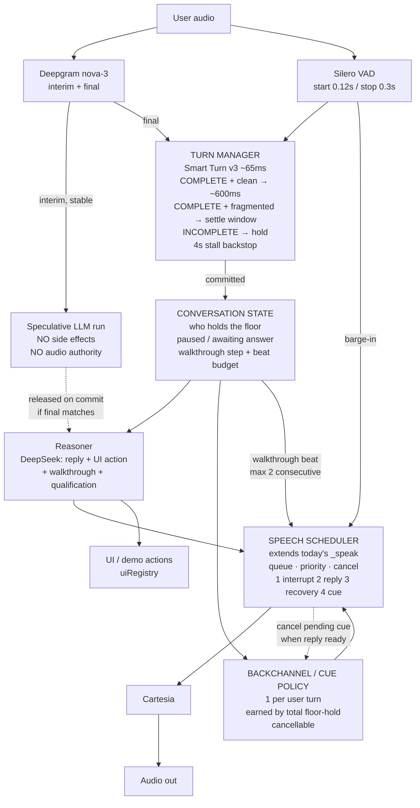

# Answers before Phase 2

2026-08-21. Every claim below is grounded in a specific line of the current code
(`8c01ffb`) or the production log from session `7d0018d3`. Nothing here is implemented
yet — this is the analysis and the implementation plan, as asked.

---

## Q1 — Exactly what is in Phase 0 and Phase 1

### Phase 0 — three changes, no architecture

**0.1 — Backchannel runs**

- *Current:* `_fragment_backchannel_sent` is reset to `False` at **five** sites. Two of
  them (`agent_processor.py:1079` and `:1108`) fire **every time a new fragment is
  appended** to the pending buffer. The watchdog then re-fires a nod after
  `FRAGMENT_BACKCHANNEL_AFTER_SECS = 2.6`. So a long thought delivered in fragments gets
  a nod roughly every 2.6 s.
- *Proposed:* the counter keys off the **user turn**, not the fragment. Re-arm only when
  a turn is genuinely released, never on append.
- *Why:* this is literally the observed bug — `Right / Mm / Mm-hm / Sure` at 02:06:38–
  02:06:59, four nods in 21 s inside one thought. Detail in Q2.

**0.2 — Auto-continue cap**

- *Current:* `_maybe_schedule_auto_continue` (`:1979`) has four guards — paused,
  `walkthrough_awaiting_answer`, `walkthrough_user_stopped`, pending fragment. **There is
  no limit on consecutive beats.** With `AUTO_CONTINUE_PAUSE_SECS = 0.1`, each beat
  chains into the next almost immediately.
- *Proposed:* a consecutive-beat counter, reset on any real user turn. Detail in Q3.
- *Why:* eight consecutive beats 02:08:39 → 02:10:05 with zero user input, ending the call.

**0.3 — Cartesia prosody check**

- *Current:* unverified whether Cartesia renders `"Hmmm —"` as a sound or spells the
  letters. It is in production on every turn.
- *Proposed:* one call, listen, and either keep or replace the pool.
- *Why:* if it spells them, every turn opens with a robot reading letters, and no amount
  of policy work fixes that.

### Phase 1 — instrumentation only, zero behaviour change

One structured JSON event per turn with the timestamps in Q4. Nothing else. This ships
before Phase 2 because **every Phase 2 decision needs a baseline that does not exist
today.**

---

## Q2 — How the backchannel runs get prevented, precisely

Not "strictly one per turn" as a blunt cap. The cap alone would still misfire, because
**the bug is that the code doesn't know what a turn is.**

Three changes together:

**(a) Re-arm on turn release, not fragment append.** Delete the reset at `:1079` and
`:1108` (the append paths). Keep it at `:1089` and `:1252` (the release paths) and `:627`
(init). This alone converts "a nod every 2.6 s" into "a nod once per turn."

**(b) Cancellable.** Treat a scheduled nod as speculative. If the semantic response
becomes ready before the nod is spoken, drop it. Prevents `"Mm-hm." → [reply]` landing
125 ms apart.

**(c) Earn it with hold duration, not fragment count.** Keep a threshold, but base it on
*total* time the user has held the floor this turn, not time since the last fragment.
Currently `held_for` measures from `_last_fragment_activity`, which resets on every
fragment — so a 20-second thought in seven fragments never accumulates 20 seconds of
"hold," it accumulates seven separate 2.8-second holds. That is the mechanical reason for
the runs.

Net effect on the observed cluster: **4 nods → 1**, placed once the user has genuinely
been holding the floor a long time.

---

## Q3 — What "cap the monologue" means technically

**Trigger.** A counter, `_consecutive_auto_beats`, incremented in
`_auto_continue_after_pause`, reset to zero whenever a real user turn is handled
(`_handle_real_turn`). When it reaches **2**, `_maybe_schedule_auto_continue` stops
scheduling.

**What happens at the cap.** Not silence — silence is how you lose someone. The agent
finishes the current beat and then **explicitly hands the floor back** with a real
question: *"That's the Source step — want me to keep going through the Brief, or is
there something you'd rather jump to?"* Then it sets `walkthrough_awaiting_answer = True`,
which is existing machinery that already stops the chain and waits.

**How control returns.** The user answers. `_handle_real_turn` resets the counter to
zero, and if they said "keep going," the chain resumes with a fresh budget of 2. So a
long tour still works — it just checks in every couple of beats instead of delivering
90 seconds unprompted.

**Second trigger, separate from the counter.** An explicit floor-yield ("let you steer",
"you tell me", "what would you like") in the agent's *own* reply should immediately set
`walkthrough_awaiting_answer = True`. Last night she said *"Let me stop talking and let
you steer"* and then delivered eight beats — the words and the state disagreed. This is
the same class of bug as the pause button and the stop-latch: state existed, one path
didn't consult it.

I'd start with the deterministic phrase check and revisit if it's too brittle.

---

## Q4 — Exact metrics, and how the four latencies separate

One JSON line per turn. Timestamps (monotonic, ms):

```
t_user_speech_start        VAD start
t_user_speech_end          VAD stop  ── the clock everything is measured from
t_stt_final                finalized TranscriptionFrame lands
t_smart_turn_verdict       + the verdict (COMPLETE / INCOMPLETE)
t_turn_committed           we accept it as a real turn
t_llm_request              run_turn_stream called
t_llm_first_token          first token back
t_first_audio_queued       first TextFrame pushed toward TTS  ← does not exist today
t_reply_complete           whole reply done
```

Derived, and these are the four you asked to separate:

| Metric | Formula | Whose problem |
|---|---|---|
| **Turn-detection latency** | `t_turn_committed − t_user_speech_end` | ours — the 1.5–2.6 s window |
| **LLM latency** | `t_llm_first_token − t_llm_request` | DeepSeek + prompt size |
| **TTS latency** | first audio out − `t_first_audio_queued` | Cartesia |
| **TTFA** | `t_first_audio_queued − t_user_speech_end` | the number that decides if it feels good |
| **TTFC** | `t_reply_complete − t_user_speech_end` | what I wrongly reported as 9.9 s |

Plus per turn: `backchannel_count`, `backchannel_cancelled`, `smart_turn_verdict`,
`released_by` (settle / stall-backstop / fast-track), `consecutive_auto_beats`,
`interrupted`.

**Important caveat:** `t_first_audio_queued` measures when we hand text to TTS, not when
sound leaves the speaker. True acoustic TTFA needs a hook in `TTSLevelReporter` (which
already exists in the pipeline for the avatar ring). I'd add the queue-time metric in
Phase 1 and the acoustic one alongside it if it's cheap — worth flagging so nobody reads
the number as more precise than it is.

---

## Q5 — Smart Turn: exact current flow vs proposed

### Current (`agent_processor.py:1049–1112`)

```
finalized transcript arrives
        │
        ├── Smart Turn == INCOMPLETE ──┬── short affirmation ("yeah"/"okay")
        │                              │        → answer NOW (fast-track, :1089)
        │                              └── otherwise
        │                                       → hold, append, return (:1075)
        │
        └── Smart Turn == COMPLETE
                    → hold, append, return   ◄── :1094–1109
                       and wait for the watchdog to notice the room has been
                       quiet for _settle_window() = 1.5–2.6 s
                       (or the 4.0 s PENDING_FRAGMENT_STALL_GRACE_SECS backstop)
```

**Both branches do the same thing.** COMPLETE and INCOMPLETE both end in "hold and wait
for a timer." The verdict changes almost nothing about latency — which means the model
is, functionally, not in the latency path at all. That is the finding.

### Proposed

```
finalized transcript arrives
        │
        ├── INCOMPLETE ──┬── short affirmation → answer now  (unchanged)
        │                └── otherwise → hold + append       (unchanged)
        │                     └ this is the case the window was BUILT for. It stays.
        │
        └── COMPLETE
              ├── no fragments held this turn AND no fragmentation seen
              │     → commit after a SHORT confirm window (~250–400 ms)
              │
              └── fragmentation already seen this turn
                    → current consolidation window (1.5–2.6 s), unchanged
```

The short window is not zero. It exists so a genuine trailing fragment still has time to
land, and so `t_stt_final` for a following word isn't missed. But it's ~300 ms rather
than ~2,000 ms.

The INCOMPLETE path — the one that actually fixes "so the thing is…" — is untouched.

---

## Q6 — False-cutoff risk and the backstop

**I will not give you a false-cutoff rate, because I don't have one and inventing it
would be worse than saying so.** We have never recorded turn-level ground truth. Getting
that number is precisely what Phase 1 is for. Anything I quoted now would be a guess
dressed as engineering.

What I can tell you is **the blast radius, which is already bounded**, and that changes
the risk calculus:

If we commit early and the prospect was not finished, they keep talking. That is a
barge-in, and we already handle barge-ins properly — VAD start at 0.12 s, the reply gets
cut, `_unspoken_remainder` is preserved, and the false-interruption resume machinery
(`FALSE_INTERRUPTION_RESUME_PREFIXES`) already exists. So a false cutoff degrades to
*"she started talking, you kept going, she stopped and listened."*

That is what humans do to each other constantly. It is materially less damaging than
*"she makes you wait 2.6 seconds after every sentence"*, which is what we ship today and
what you have now described as not world-class twice.

**The conservative rollout — ship the dial, not the value:**

1. `FAST_COMMIT_SECS` as a configurable constant, defaulting to **600 ms**, not 300. Half
   the current cost, still cautious.
2. **Keep every existing backstop.** The 4 s stall net, the settle window for the
   fragmented case, the INCOMPLETE hold — none are removed. This is an added fast path,
   not a replacement.
3. **Auto-widen on evidence.** If a turn is committed fast and the user speaks again
   within ~1 s (i.e. we cut them off), increment a per-session counter and widen
   `FAST_COMMIT_SECS` for the rest of that call. The system detects its own mistake and
   backs off, per-caller. This is the piece I'd most want in from day one.
4. Measure for a few calls at 600 ms, then decide about 300.

---

## Q7 — Preemptive generation, and how it can't answer an unfinished thought

**We already have the raw material and we're throwing it away.** `bot.py:392–395`:
`interim_results=True` is already enabled on Deepgram (it's required for
`utterance_end_ms`), and the comment says outright that `InterimTranscriptionFrame` is
*"ignored downstream."* So partial transcripts are already streaming into the process
and being dropped.

**Mechanism:**

1. Watch interim transcripts. When one is **stable** — unchanged for ~200 ms and longer
   than a few words — start the LLM call on it, in the background.
2. **Generate, but do not speak.** The result is held. Nothing is queued to TTS.
3. On turn commit, compare the final transcript to the speculative one. Materially the
   same → release the held result immediately (TTFA collapses toward the TTS latency
   alone). Different → **discard and re-run** on the real text.

**Why it can't answer an unfinished thought:** because speaking is gated on turn commit,
not on generation. The speculative run has no authority to produce audio. Turn detection
still decides when the agent may speak — preemption only decides when it may *think*.
The only cost of being wrong is a wasted API call.

**The known trap, and we've hit it before.** A speculative run must have **zero side
effects** — no UI action firing, no history append, no DB write, no walkthrough state
change. We built speculative execution once already for walkthrough prefetch and shipped
exactly this bug (prefetch side-effects leaking into the transcript DB, fixed as task
#171). Same discipline applies, and I'd reuse that pattern rather than reinvent it.

---

## Q8 — Pipecat: upgrade vs hand-roll

**Current state, verified:** installed `pipecat-ai 1.7.0`. `preemptive` does not appear
in `PipelineParams` (checked the source). `pipecat.processors.user_turn_stop_strategy`
does not exist in this version. `local_smart_turn_v3` **does** exist and we use it — but
we call it **manually** from our own processor (`_analyze_smart_turn`, `:1037`) rather
than attaching it as the transport's `turn_analyzer`. Our `FastAPIWebsocketParams`
(`bot.py:84`) has no `turn_analyzer` at all.

That's the real finding here: **we hand-rolled the turn-taking layer the framework now
ships natively**, and we're maintaining a parallel implementation that is slower than the
framework default.

| | Upgrade Pipecat | Hand-roll preemption |
|---|---|---|
| Effort | Small if clean, unbounded if not | ~1 day, known scope |
| Risk | Framework bump on the box running live demos; 1.7 → current spans real API churn (transport params, turn-stop strategy, frame types). We broke prod this week on a *single missing import* | Contained to `agent_processor.py`, which we own |
| Payoff | Preemption + native turn strategy + future fixes for free | Preemption only; keeps us diverged from upstream |

**Recommendation: hand-roll now, upgrade deliberately later.** Not because upgrading is
wrong — long term it's clearly right, and being diverged from the framework is how we got
here — but because doing it this week, alongside a turn-timing change, means two
variables moving at once on a box with demos scheduled. Do the upgrade as its own change,
on its own day, with the stress harness and a real call as the gate.

---

## Q9 — Data we have, and what to capture

**We have no audio. None.** Verified: nothing in `bot.py` records — no
`AudioBufferProcessor`, no file writes. Every call's audio is discarded when the
WebSocket closes.

**What we do have:** transcript turns with timestamps (686 rows), verdict-free logs, and
the event lines I mined last night (`settled`, `stalled`, `fragment held`, `barge-in`).
Enough to prove the backchannel bug. **Not enough to tune turn detection**, because it
contains no ground truth about whether the person had actually finished.

**What to capture, in priority order:**

1. **Per-turn structured events** (Phase 1). Cheapest, biggest immediate win.
2. **Raw call audio** for a handful of consented internal calls. This is the only thing
   that makes the harness honest — with real audio I can replay it through Smart Turn and
   get its *actual* verdicts instead of my hardcoded ones. This is what makes Phase 2
   safe rather than a guess. Note it's a privacy decision, not just a technical one:
   internal calls only, explicit heads-up to whoever's on them, and a retention limit.
3. **A false-cutoff signal**: log whenever the user speaks within 1 s of the agent
   starting. That's a cheap proxy for "we cut them off" and it works without audio.

If capturing audio isn't acceptable, item 3 alone still gives a usable feedback loop —
just slower to converge.

---

## Q10 — Proposed architecture



**Where the three things you asked about sit:**

- **Interruption** enters at VAD and goes *straight to the scheduler*, bypassing
  everything else. It's the highest priority and it must never queue behind policy.
- **Cancellation** is the scheduler's job, and it's bidirectional: a ready reply cancels
  a pending cue; a barge-in cancels everything.
- **UI/demo actions** hang off the Reasoner, not the scheduler — they're not audio. But
  they read the same conversation state, which is what stops the screen and the voice
  disagreeing (the "I've got Nikotex selected" lie).

**What already exists:** `_speak()` is genuinely the single audio choke point today —
every one of ~20 call sites goes through it. It has one policy (`if self._paused:
return`). Phase 5 adds queue/priority/cancel to it. This is an extension, not a new
subsystem.

---

## Summary of what I'd do, in order

| | What | Effort | Risk |
|---|---|---|---|
| **0** | Backchannel turn-scoping + cancel; auto-continue cap + floor-yield; Cartesia ear-check | 2–3 h | Low |
| **1** | Per-turn structured events, TTFA vs TTFC, false-cutoff signal | 2–3 h | None |
| **2a** | Fix the harness — real audio or real verdicts | ½–1 day | None (test-only) |
| **2b** | Fast-commit path, 600 ms, auto-widening, all backstops kept | 1 day | **Medium** — gated on 1 + 2a |
| **3** | Preemptive generation, hand-rolled | 1 day | Medium |
| **4** | Talker/Reasoner split | 1–2 days | Medium |
| **5** | Scheduler priority + walkthrough state machine | 1–2 days | Low, but invisible in a demo |

**Phases 0 and 1 I'd ship today** — they fix what you heard, they change no timing
behaviour, and they create the baseline. **Phase 2 I will not start until 1 and 2a are
done and you've answered the risk question**, because that's the phase where I previously
made this exact trade and got it wrong.
